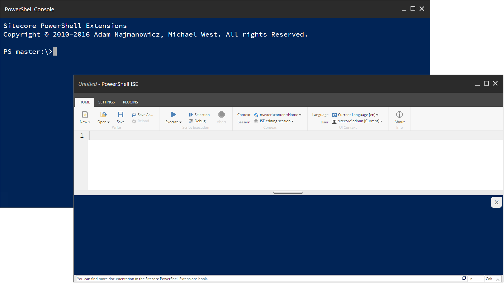

# Sitecore PowerShell Extensions

A command line and scripting tool built for the Sitecore platform.



---

## Notice

>
* If you are using version 4.2 or older in your environments we recommend you update them to 5.0+ ASAP
* We recommend that you DO NOT install SPE on Content Delivery servers
or run it in setups that face the Internet in an unprotected connections
(e.g. outside of a VPN protected environment)
* Sitecore versions 7.x and below are no longer supported with the release of SPE 5.0
---

[](https://opensource.org/licenses/MIT)

The Sitecore PowerShell Extensions module (SPE) provides a robust environment for automating tasks within Sitecore.


## Prerequisites

- [Task](https://taskfile.dev/) — install via `winget install Task.Task`, `choco install go-task`, or `scoop install task`
- Docker Desktop for Windows
- Visual Studio 2022+ with the .NET desktop workload

## Quick Start

Run `task --list` to see all available commands:

```
task init            # Set up local dev environment (license, certs, .env)
task up              # Start Docker environment
task down            # Stop Docker environment
task logs            # Tail CM container logs
task build           # Build the solution
task deploy          # Deploy build output to Docker container
task generate        # Generate .dat files from serialized content
task release         # Build release packages
task verify          # Validate packages against serialized items
task test            # Run integration tests
task clean           # Clean build artifacts
```

### First-time setup

```powershell
task init -- -LicenseXmlPath "C:\path\to\license.xml"
task up
task build
task deploy
```

## Directory Layout

```
├── .github/              GitHub Actions workflows
├── docs/                 Images and documentation assets
├── src/                  .NET source code + build scripts
│   ├── Spe/              Main project
│   ├── Spe.Abstractions/
│   ├── Spe.Sitecore92/
│   ├── Spe.Package/
│   ├── Post_Build.ps1    MSBuild post-build (referenced by csproj)
│   └── Deploy_Functions.ps1
├── serialization/        SCS content serialization (YAML items)
│   ├── sitecore.json
│   └── modules/          Module definitions + serialized items
├── modules/              PowerShell remoting module (SPE)
│   └── SPE/
├── docker/               Docker build context and tooling
│   └── .env.template     Environment variable template
├── scripts/              Developer & release automation
│   ├── init.ps1          Local environment setup
│   ├── build-release.ps1 Full release pipeline
│   ├── verify-packages.ps1
│   ├── build-images.ps1
│   ├── generate-dat.ps1
│   └── setup-module.ps1
├── tests/                Test suites
│   ├── unit/             SPE module unit tests
│   ├── integration/      Remoting integration tests
│   ├── examples/         Script examples
│   └── fixtures/         Test data (images, archives)
├── translations/         Language CSV data
├── _output/              Build output (gitignored except configs)
├── packages/             NuGet packages (packages.config format)
├── Spe.sln               Visual Studio solution
├── docker-compose.yml    Docker Compose services
├── Taskfile.yml          Task runner configuration
└── NuGet.config
```

## Examples

Consider some of the following examples to see how SPE can improve your quality of life as a Sitecore developer/administrator:

- Make changes to a large number of pages:
```powershell
Get-ChildItem -Path master:\content\home -Recurse |
    ForEach-Object { $_.Text += "<p>Updated with SPE</p>"  }
```

- Find the oldest page on your site:
```powershell
Get-ChildItem -Path master:\content\home -Recurse |
    Select-Object -Property Name,Id,"__Updated" |
    Sort-Object -Property "__Updated"
```

- Remove a file from the Data directory:
```powershell
Get-ChildItem -Path $SitecoreDataFolder\packages -Filter "readme.txt" | Remove-Item
```

- Rename items in the Media Library:
```powershell
Get-ChildItem -Path "master:\media library\Images" |
    ForEach-Object { Rename-Item -Path $_.ItemPath -NewName ($_.Name + "-old") }
```

### Resources

* Download from the [Releases page](https://github.com/SitecorePowerShell/Console/releases). Note that the Marketplace site is no longer maintained, and should not be used.
* Read the [SPE user guide](https://doc.sitecorepowershell.com/).
* See a whole [variety of links to SPE material](http://blog.najmanowicz.com/sitecore-powershell-console/).
* Watch some quick start [training videos](http://www.youtube.com/playlist?list=PLph7ZchYd_nCypVZSNkudGwPFRqf1na0b).

| [](https://github.com/AdamNaj) | [](https://github.com/michaellwest) |
| ---|--- |
| [Adam Najmanowicz](https://blog.najmanowicz.com) | [Michael West](https://michaellwest.blogspot.com) |
| Founder, Architect & Lead Developer | Developer & Documentation Lead |
